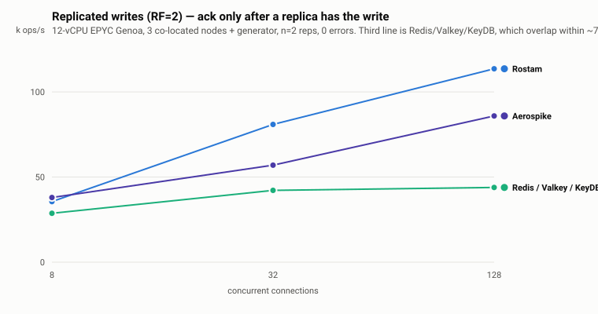

# rostam-bench

Public, reproducible benchmarks comparing the **[Rostam](https://github.com/rostamlabs/rostam)**
engine against popular alternatives. This repository is intentionally **separate** from the
engine module so the engine's `go.mod` stays dependency-light — the comparison libraries
(and their transitive dependency trees) live here, never in the engine.

It contains several independent comparison suites:

| Suite | What it compares | Where |
|-------|------------------|-------|
| **Vector** | Rostam's vector search vs. **RediSearch**, Qdrant, and hnswlib (SIFT-1M) | [`sift1m/`](./sift1m) |
| **Vector (third-party harness)** | Rostam vs. **Milvus**, **pgvector**, **Weaviate**, **Qdrant**, **Redis** under VectorDBBench (Cohere-1M, 768d) | [`vectordbbench/`](./vectordbbench) |
| **Networked KV** | Rostam vs. **Memcached**, **Dragonfly**, **Aerospike**, **Valkey**, **Redis**, **KeyDB** over the wire (throughput + latency), plus RF=2 replicated writes against Aerospike and the Redis family | [`netkv/`](./netkv) |
| **Cache** | Rostam's in-memory cache vs. freecache, Ristretto, BigCache, fastcache, Otter | `cache_bench_test.go` (this module) |

> **Results are directional.** All numbers are single-machine, single-run measurements.
> They depend heavily on CPU, core count, memory bandwidth, value sizes, key distribution,
> and concurrency. Use them to understand *relative* behaviour and trade-offs, not as
> absolute throughput guarantees. Re-run on your own hardware before drawing conclusions.

---

## Vector comparison

See [`sift1m/`](./sift1m) for the SIFT1M vector-search harness comparing Rostam against
**RediSearch**, **Qdrant**, and **hnswlib** (recall/latency/QPS). It includes the gRPC
server harness, Python clients, and the competitor benchmark scripts. Refer to
[`sift1m/README.md`](./sift1m/README.md) for setup and methodology.

For a neutral, third-party comparison across ~30 engines (Milvus, Weaviate, pgvector,
Pinecone, Elasticsearch, …) on standardized datasets/metrics, see
[`vectordbbench/`](./vectordbbench) — a **[VectorDBBench](https://github.com/zilliztech/VectorDBBench)
client plugin for Rostam** (`install.sh` injects it into a VDBBench checkout).

### Head-to-head: six engines, 27 cases, one session

<picture>
  <source media="(prefers-color-scheme: dark)" srcset="vectordbbench/charts/pareto-dark.svg">
  
</picture>

Cohere-1M (768d, cosine), HNSW `m=16` / `ef_construction=200` / `k=100` pinned identically
on every engine, ef swept. **Throughput at matched recall** — the only like-for-like
comparison, because engines reach different recall at the same ef:

| Matched recall | Rostam | vs Milvus | vs pgvector | vs Weaviate | vs Qdrant | vs Redis |
|---|--:|--:|--:|--:|--:|--:|
| 0.95 | 3,161 QPS | 1.84× | 1.83× | 3.25× | — | 6.54× |
| 0.97 | 2,642 QPS | 2.02× | 2.18× | 3.03× | 4.16× | 7.53× |
| 0.98 | 2,088 QPS | 1.90× | 2.28× | 2.67× | 3.98× | 7.90× |
| 0.99 | 1,471 QPS | 1.78× | — | — | 3.55× | — |

Rostam also has the **fastest load** (282 s) while spending the **least total CPU** of any
multi-core engine, and reaches the **highest recall in the matrix** (0.9978).

Three things bound what this means, and they are not footnotes:

- **Same-session only.** With engine code *unchanged*, Milvus's own max QPS has drifted
  **42%** between sessions on this box. All 27 cases are one continuous session.
- **The benchmark client shares the 12 cores** with the engine, which penalises the
  *fastest* engine hardest — so the QPS figures are floors, not ceilings.
- **Comparators are tuned up, not down.** pgvector is given real build resources
  (its defaults build HNSW single-threaded in a 64 MB buffer), and the stock Weaviate
  adapter was patched because it tears down a batch executor shared across VDBBench's
  concurrent insert workers.

Full per-ef curves, the filter case, four paired A/B controls, per-engine CPU accounting,
and the complete caveats are in
[`vectordbbench/README.md` → Results](./vectordbbench/README.md#results).

---

## Networked KV comparison

Seven engines over the wire, one machine, one session — full methodology,
charts, and the replication / sharding / mmap studies are in
[`netkv/README.md`](./netkv/README.md). Single-node, in-memory, no replication
and no per-op fsync on every engine; competitors run in containers with
`--network host` and identical `--ulimit nofile`, because Docker's default 1024
silently throttles them above ~1000 connections and inflates Rostam's lead.

**GET (ops/s)**

| conns | **Rostam** | Memcached | Dragonfly | Aerospike | Valkey | Redis | KeyDB |
|------:|------:|------:|------:|------:|------:|------:|------:|
| 8   | 360.2k | **367.8k** | 234.1k | 318.4k | 210.3k | 213.2k | 192.5k |
| 64  | **726.1k** | 682.9k | 532.0k | 510.6k | 239.1k | 228.3k | 206.3k |
| 256 | **732.4k** | 681.7k | 551.6k | 516.9k | 227.9k | 219.6k | 208.8k |
| 512 | **705.1k** | 667.1k | 518.7k | 513.6k | 221.3k | 208.5k | 196.3k |

p99 at 512 connections (GET): Rostam **2.02 ms**, Memcached 2.32, Aerospike
2.75, Dragonfly 2.90, Valkey 3.59, KeyDB 3.84, Redis 4.69. PUT tracks GET
closely (Rostam 699.2k at 256 connections).

Memcached wins at 8 connections and Rostam pulls ahead as concurrency rises, so
the shape worth reading here is the scaling curve, not the peak.

### Replicated writes (RF=2, synchronous replica ack)

Every engine at **matched commit semantics**, which is the only comparison that
means anything: acking after a replica has the write, versus acking at the
master. Rostam runs PB at full ISR, Aerospike `commitLevel=all`, and the
Redis-protocol engines master + replica with `WAIT 1`. 12-vCPU EPYC Genoa, 3
co-located nodes + generator, PUT-only, n=2 reps, 0 errors. Full detail in
[`netkv/replication/`](./netkv/replication).

<picture>
  <source media="(prefers-color-scheme: dark)" srcset="netkv/charts/rf2-commit-all-dark.svg">
  
</picture>

Measured twice, four days apart, on the same box. The 2026-08-09 reproduction:

All seven engines up together, so every row shares conditions:

| engine (replica-ack) | 8 conns | 32 conns | 128 conns | p50 @128 |
|---|--:|--:|--:|--:|
| **Rostam PB commit-all** | 35.6k | **80.9k** | **113.6k** | **0.99 ms** |
| Aerospike CE `COMMIT_ALL` | **38.0k** | 57.0k | 85.9k | 1.35 ms |
| Redis 7 (`WAIT 1`) | 28.7k | 43.2k | 42.9k | 2.95 ms |
| Valkey 8 (`WAIT 1`) | 28.0k | 42.2k | 45.9k | 2.72 ms |
| KeyDB (`WAIT 1`) | 28.9k | 42.1k | 43.9k | 2.86 ms |
| _memcached (NO replication)_ | _106.5k_ | _216.1k_ | _271.7k_ | _0.40 ms_ |

Measured with only Rostam and Aerospike resident — less CPU stolen by idle
engines — the pair reads 35.6k / 77.5k / **123.1k** against 37.0k / 58.8k /
**89.1k**. Both conditions are in
[`replication/README.md`](./netkv/replication/README.md); the table above is the
one where all six rows are comparable to each other.

Commit-master (measured as a pair): Rostam 57.8k / 103.0k / **157.4k**,
Aerospike 65.3k / 94.2k / 125.7k. Dragonfly is absent because it does not work
under `WAIT 1` — ~102 ms per op at every concurrency — not because it is slow.

**Rostam's lead is a scaling property, not a per-op one.** Aerospike is ahead at
8 connections in both postures — by 4% at commit-all and 13% at commit-master,
with a better tail there too (p99 288 µs against 369 µs). Rostam overtakes at 32
and leads **+32% / +38%** at 32/128 under matched semantics, with the better p50
from 32 upward. Which regime you are in decides which engine wins, and that is a
more useful thing to know than a single multiple.

Across the two sessions Rostam reproduced within ~1-4% at 8 and 128 connections
while Aerospike came out 9-17% faster the second time, narrowing the matched-
semantics lead from +42%/+49% to +32%/+38%. Same box, same scripts, four days
apart — which is the documented cross-session drift here, and the reason every
row is quoted same-session.

This is **system-vs-system at equal replication, not per-core efficiency**: Redis
and Valkey are single-threaded per instance, the Rostam cluster spanned three
processes at `GOMAXPROCS=3`, and the generator shared the box — so no row is a
saturation ceiling for anyone.

**Over a real network the picture is tighter.** A separate run on 4 dedicated
CCX53-class nodes reaches near-parity when driven from two load generators
(Rostam ~282–305k, Aerospike ~288–315k), with Rostam's tail still better (p99
~8 ms vs 17–22 ms). Driven from **one** generator that run is meaningless in
both directions: the clusters sit 92–98% idle while the generator's own CPU caps
it near 150k, and Aerospike's ~230 µs tighter per-op latency converts straight
into apparent throughput. Use ≥2 generators, or pipeline.

---

## Cache comparison

`cache_bench_test.go` (package `cachebench`) runs an **apples-to-apples** in-memory cache
comparison on an **identical workload** for every engine:

- **65,536** random **16-byte** keys
- **256-byte** values
- a `RunParallel` **Get-hit** benchmark against a pre-populated cache
- a `RunParallel` **Put** benchmark

Every cache is sized generously (≥ 512 MiB byte budget, or ≥ 4× the key count for the
entry-counted caches) so the Get-hit benchmarks never evict, keeping the comparison fair.

### Run it

```bash
go test -bench=. -benchmem ./...
```

(Use `-benchtime=3s` or `-count=5` for statistically meaningful numbers; the default
single-pass run is only a smoke test.)

### Engines and their (real, version-pinned) APIs

| Engine | Module @ version | Key type | Constructor | Set | Get |
|--------|------------------|----------|-------------|-----|-----|
| **Rostam** | `github.com/rostamlabs/rostam/cache` (local, Apache-2.0) | `[]byte` | `cache.New(cache.DefaultConfig())` | `Put(k, v, ttl)` | `Get(k)` |
| **freecache** | `github.com/coocood/freecache v1.2.7` | `[]byte` | `NewCache(size)` | `Set(k, v, expireSec)` | `Get(k)` |
| **Ristretto** | `github.com/dgraph-io/ristretto/v2 v2.4.0` | `[]byte` (generic) | `NewCache(&Config[[]byte,[]byte]{…})` | `Set(k, v, cost)` *(async)* | `Get(k)` |
| **BigCache** | `github.com/allegro/bigcache/v3 v3.1.0` | `string` | `New(ctx, DefaultConfig(ttl))` | `Set(k, v)` | `Get(k)` |
| **fastcache** | `github.com/VictoriaMetrics/fastcache v1.13.3` | `[]byte` | `New(maxBytes)` | `Set(k, v)` | `Get(dst, k)` |
| **Otter** | `github.com/maypok86/otter v1.2.4` | `string` (generic) | `MustBuilder[string,[]byte](cap).WithTTL(ttl).Build()` | `Set(k, v)` | `Get(k)` |

### Fairness caveats (where APIs force a deviation)

The workload bytes are identical across engines. A few libraries cannot accept the exact
same call shape, and each deviation is also flagged with a `//` comment at its call site:

- **Ristretto** — `Set` is **asynchronous** and **cost-based**. The populate loop passes
  `cost = len(value)` and calls `c.Wait()` before the Get-hit benchmark so every key is
  admitted. In the Put benchmark, writes are fire-and-forget into the admission buffer
  (this is Ristretto's design, not a measurement artifact).
- **BigCache** and **Otter** — use **string keys**. The identical 16-byte keys are
  converted to strings once, up front, into a parallel slice; the per-op hot path does no
  conversion.
- **Otter** — capacity is an **entry count**, not a byte budget (unless a cost function is
  set), so it is sized to 4× the key count.
- **fastcache** — has **no TTL** and `Get` appends the value into a caller-supplied
  destination buffer.
- **freecache** — TTL is in **seconds** (`0` = no expiry).

If any library ever fails to build or its API can't be honestly mapped to this workload,
that is documented here rather than papered over.

### Results (single machine, 20 cores — directional, single-run)

Three read workloads tell different stories. All are `GetHit`, **ns/op, lower is better**.

| Engine | Normal (uniform, 256 B) | Hot-key (256 B) | Hot-key (8 B, read mechanics) |
|--------|--:|--:|--:|
| **Otter** | 10.8 | 11.6 | **4.7** |
| **fastcache** | 16.4 | 18.4 | 15.9 |
| **Ristretto** | 17.0 | 17.7 | 14.8 |
| **Rostam** | 20.8 | 19.2 | **10.9** |
| **freecache** | 27.4 | **208.9** | 99.1 |
| **BigCache** | 44.0 | 40.1 | 16.6 |

- **Normal** (`Benchmark<Engine>_GetHit`, uniform keys) — Rostam is mid-pack; with no read
  contention the value copy + entry decode dominate and the lean blob caches win.
- **Hot-key** (`BenchmarkHot<Engine>_GetHit`, Zipfian `s=1.1`) — exposes read-lock
  contention that uniform keys hide. **freecache collapses** (it takes an *exclusive* mutex
  on `Get` to update LRU); Rostam holds steady (lock-free reads).
- **Hot-key, 8 B** (`BenchmarkHotSmall<Engine>_GetHit`) — strips the value-copy floor so the
  **read mechanics** (lock strategy) dominate. Rostam is **#2, behind only Otter**.

> **Methodology — the payload floor.** The GetHit loops read every returned byte
> (`consumeAll`) so the compiler can't elide the value copy, and the zero-copy engines
> (Otter/Ristretto) are copied into an owned buffer for fairness. With a 256 B value that
> *shared* copy is ~30% of every measurement, which **compresses the gaps between engines**.
> The 8 B variant removes that floor, so lock-strategy differences show clearly — that is the
> honest read-mechanics comparison. Rostam also carries framing, CRC-on-write, TTL, and
> optional mmap persistence the pure in-memory caches skip.

Shard-count sensitivity (`shardsweep_test.go`): Rostam Get is flat across `NumShards`, but its
hot-key lead over the RLock-based caches **widens at lower shard counts / higher skew**, where
per-shard read contention bites hardest.

### The axis this benchmark does not measure: GC pressure

These six engines are two different architectures, and `ns/op` cannot see the
difference:

| | storage model | GC cost as entries grow |
|---|---|---|
| Rostam, freecache, BigCache, fastcache | serialized into a few large **pointer-free** slabs | flat — the collector sees O(shards) objects |
| **Otter, Ristretto** | **Go objects** (`string` keys, typed values) | scales with **entry count** |

Otter stores `string` → `[]byte` as live heap objects, so every entry is a
pointer-bearing object the collector traces on each cycle; at ten million entries
that is ten million-plus objects to mark. Avoiding exactly that is why BigCache
and freecache exist, and why Rostam's cache stores bytes in slab pages.

A per-op latency benchmark with a modest working set flatters the object stores
twice: they skip serialization, and mark-phase cost never appears in a median.
**Otter's 4.7 ns lead is real** — and so is the pause time it adds to a
long-running process holding millions of entries. This suite measures the first
and not the second, so treat the ranking as "read mechanics", not "which cache to
run at scale".

---

## License

Apache-2.0 — Copyright 2026 RostamLabs. See [`LICENSE`](./LICENSE).

The Rostam **engine** itself is licensed separately (Apache-2.0) in its own repository; this
benchmark module depends on the engine's public `cache` API via a local `replace`
directive for development builds.
