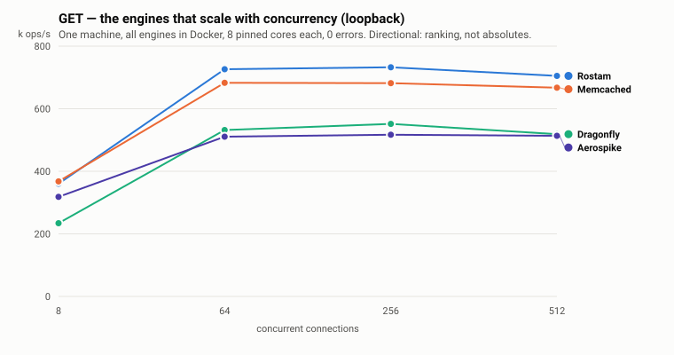
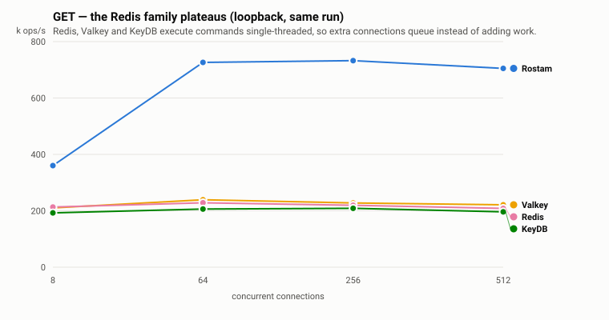
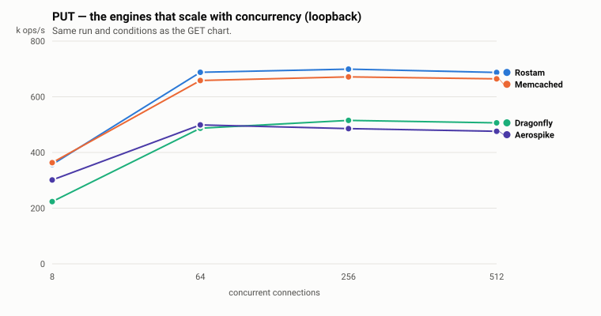
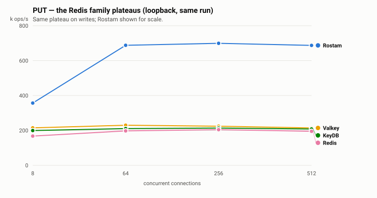
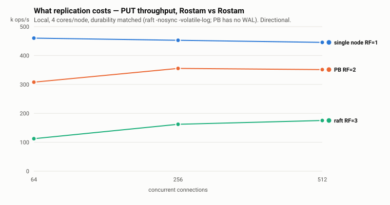
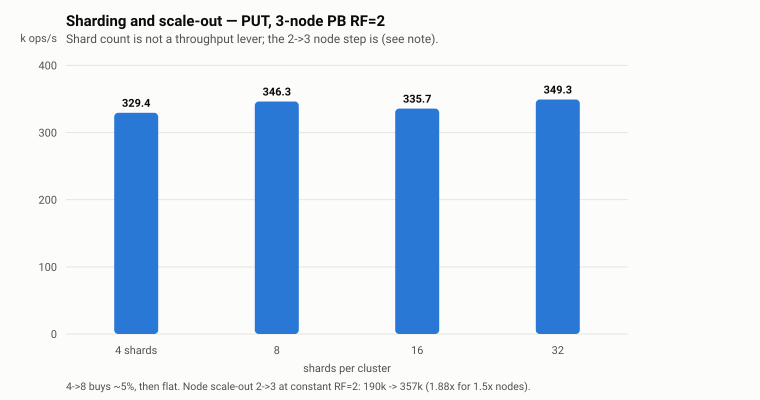
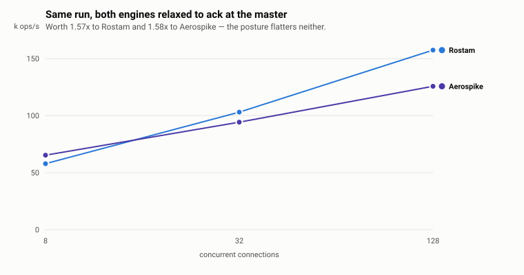

# Networked KV benchmark — Rostam vs Redis / Valkey / Dragonfly / KeyDB / Memcached / Aerospike

A **fair, networked** key/value throughput + latency comparison. Unlike the
in-process [`cache` suite](../README.md#cache-comparison) (which measures the raw
Go cache library at nanosecond scale), this measures the thing that actually
matters for a *networked data store*: the full `client → wire protocol → server →
response` round-trip, where the network and protocol dominate and the ~10 ns
in-process cache is a rounding error.

Rostam's real peers here are **networked stores** — Redis, Valkey, Dragonfly,
KeyDB, Memcached, and Aerospike — not in-process Go libraries.

## What it does

One Go load generator (`main.go`) drives every engine with an **identical**
workload; only the per-op client call differs:

- **N** distinct 16-byte keys (default 50,000), **256-byte** values
- `C` concurrent workers each issue GET (`readpct`%) or PUT for `duration`
  seconds, every op individually timed
- a warmup window is excluded from the measurement
- reports **ops/sec** and **p50 / p99 / p999** latency

```
go build -o netkv ./netkv
./netkv -engine rostam    -conns 64 -duration 5 -readpct 100
./netkv -engine redis     -conns 64 -duration 5 -readpct 100
./netkv -engine valkey    -conns 64 -duration 5 -readpct 100   # -valkey    host:port (redis wire)
./netkv -engine dragonfly -conns 64 -duration 5 -readpct 100   # -dragonfly host:port (redis wire)
./netkv -engine keydb     -conns 64 -duration 5 -readpct 100   # -keydb     host:port (redis wire)
./netkv -engine memcached -conns 64 -duration 5 -readpct 100   # -memcached host:port
./netkv -engine aerospike -conns 64 -duration 5 -readpct 100
./netkv -engine rostam    -conns 64 -duration 5 -dist zipf     # hot-key (Zipfian s=1.1)
```

## Fairness controls (each one mattered)

These are the things that, left unaddressed, silently bias the result:

| Control | Why |
|---|---|
| **All engines in separate processes** | An embedded same-process Rostam server skips the cross-process context switch every network round-trip pays — a ~3× single-op latency advantage a real deployment never gets. Rostam runs as a standalone `rostam-server`. |
| **`--network host` for the containers** | Docker's published-port NAT adds latency to every Redis/Aerospike round-trip; host networking puts them on the same loopback as Rostam. |
| **In-memory, single-node, no replication, no per-op fsync — all three** | Apples-to-apples durability/consistency. Rostam runs single-node *direct* (no Raft), matching Redis/Aerospike single-node semantics. |
| **Identical load generator** | Same concurrency model, timing, key distribution, value size — only the client call differs. |
| **Identical fd limits (`--ulimit nofile`) on every container** | Docker caps a container at **1024** open files regardless of the host's `limits.conf`, while a natively-launched `rostam-server` inherits the host limit. Above ~1000 concurrent connections that silently throttles every containerised competitor and **inflates Rostam's lead**. Aerospike makes it obvious (it refuses to start: `1024 system file descriptors not enough`); Redis/Memcached/Dragonfly/KeyDB just quietly degrade. Pass the same `--ulimit` to all of them. |
| **Same runtime for everyone** | If the competitors run in Docker, run Rostam in Docker too, or Rostam alone skips the container's network/cgroup overhead. `cmd/rostam-server/Dockerfile` in the engine repo builds a suitable image. |

## Results — 2026-07-28

237 measurement rows, all from one machine on 2026-07-28. Medians of 3; every
point reported here had **0 errors**.

Everything below is loopback on a single laptop, engine and load generator
pinned to disjoint core sets. Wire-level numbers are deliberately not shown —
see the NIC caveat under [Caveats](#caveats) for why a cloud wire benchmark
needs its RX-queue count checked first.

**Storage scope — which runs are heap and which are mmap.** `-data ""` gives a
pure heap cache; `-data <dir>` gives an **mmap** cache backed by per-shard
`pages.dat` (`cache.Config.DataDir`, Linux only). This is not optional in
cluster mode:

| section | storage |
|---|---|
| 1 (competitive sweep) | **heap** — matching the competitors' no-persistence configs |
| 2 (replication) and 3 (sharding) | **mmap** — `-cluster` refuses to start without a data dir (`cluster.Config: DataDir is required`) |
| 4 (heap vs mmap) | both, measured head to head |

Vector storage (`-persistent-vectors`) was not exercised. Nothing here measures
a working set larger than RAM.

### 1. Competitive sweep — 7 engines, one machine

Every engine in Docker, 8 pinned cores each, generator pinned to 8 others,
100k keys x 256 B, loopback. 168 rows, 0 errors, all spreads <= 10%.

<picture>
  <source media="(prefers-color-scheme: dark)" srcset="charts/local-get-fast-dark.svg">
  
</picture>

<picture>
  <source media="(prefers-color-scheme: dark)" srcset="charts/local-get-family-dark.svg">
  
</picture>

**GET (ops/s)**

| conns | **Rostam** | Memcached | Dragonfly | Aerospike | Valkey | Redis | KeyDB |
|------:|------:|------:|------:|------:|------:|------:|------:|
| 8   | 360.2k | **367.8k** | 234.1k | 318.4k | 210.3k | 213.2k | 192.5k |
| 64  | **726.1k** | 682.9k | 532.0k | 510.6k | 239.1k | 228.3k | 206.3k |
| 256 | **732.4k** | 681.7k | 551.6k | 516.9k | 227.9k | 219.6k | 208.8k |
| 512 | **705.1k** | 667.1k | 518.7k | 513.6k | 221.3k | 208.5k | 196.3k |

**PUT (ops/s)**

<picture>
  <source media="(prefers-color-scheme: dark)" srcset="charts/local-put-fast-dark.svg">
  
</picture>

<picture>
  <source media="(prefers-color-scheme: dark)" srcset="charts/local-put-family-dark.svg">
  
</picture>

| conns | **Rostam** | Memcached | Dragonfly | Aerospike | Valkey | KeyDB | Redis |
|------:|------:|------:|------:|------:|------:|------:|------:|
| 8   | 357.0k | **363.5k** | 223.6k | 301.4k | 214.7k | 199.3k | 167.6k |
| 64  | **688.0k** | 658.4k | 487.0k | 499.1k | 229.8k | 210.6k | 197.5k |
| 256 | **699.2k** | 671.5k | 515.1k | 485.6k | 224.1k | 213.7k | 204.6k |
| 512 | **687.4k** | 664.5k | 506.5k | 476.1k | 214.3k | 208.3k | 195.3k |

**p99 latency at 512 conns (GET):** Rostam **2.02 ms**, Memcached 2.32, Aerospike
2.75, Dragonfly 2.90, KeyDB 3.84, Valkey 3.59, Redis 4.69.

Three tiers, and the honest reading of them:

- **Memcached is the real competitor, and it beats Rostam at low concurrency.**
  At 8 conns Memcached leads on both GET (367.8k vs 360.2k) and PUT (363.5k vs
  357.0k). Rostam pulls ahead from 64 conns but only by **1.03-1.07x**. Anyone
  quoting a large Rostam-over-Memcached number is quoting the wrong workload.
- **Against Dragonfly and Aerospike, Rostam leads ~1.36x** at 512 conns.
- **Against the Redis family the gap is structural, not incremental**: Redis,
  Valkey and KeyDB execute commands single-threaded, so they plateau at
  ~200-240k regardless of connections while Rostam scales to ~700k — **~3.2x at
  512 conns**, and the ratio grows with load (1.69x at 8 -> 3.38x at 512 vs
  Redis). Valkey tracks Redis closely, marginally ahead on most points.
- **Rostam has the best tail latency in the field** at every concurrency level.

### 2. What replication costs

<picture>
  <source media="(prefers-color-scheme: dark)" srcset="charts/replication-dark.svg">
  
</picture>

Rostam vs Rostam, PUT-only (reads do not replicate), 4 cores/node. Durability
matched: raft runs `-nosync -volatile-log`, PB has no WAL, so both commit on
in-memory replication acks only.

| conns | single node RF=1 | PB RF=2 | raft RF=3 |
|------:|------:|------:|------:|
| 64  | 460.2k | 307.9k | 112.4k |
| 256 | 452.8k | 355.5k | 162.3k |
| 512 | 445.5k | 351.5k | 175.3k |

**PB beats raft 2.0x-2.7x.** That direction reproduces the engine repo's
real-network gate in `shard/pbisr/BENCHMARK.md` (~1.7x on 4x CCX33) — different
hardware, different harness, same conclusion, which makes it the most
trustworthy result in this file.

**Do not quote a single "replication costs X%" figure.** It measured 42-49% on
an earlier run of this same comparison and 21-33% here; the difference is
machine state, not code. The safe statement is "roughly a quarter to a half of
single-node write throughput, on this class of hardware."

Two things this table is **not**: PB RF=2 keeps 2 copies against raft RF=3's 3,
so it is doing less work partly because it stores less (PB at RF=3 *loses* to
raft over a real network — see `BENCHMARK.md`). And the single node has 4 cores
while each cluster has 12 in total, so this is deployment-vs-deployment, not
per-core efficiency.

### 3. Sharding and scale-out

<picture>
  <source media="(prefers-color-scheme: dark)" srcset="charts/sharding-dark.svg">
  
</picture>

| shards (3-node PB RF=2) | 4 | 8 | 16 | 32 |
|---|---:|---:|---:|---:|
| PUT @128 conns | 335.4k | 351.9k | 353.2k | 347.5k |
| PUT @512 conns | 329.4k | 346.3k | 335.7k | 349.3k |

**Shard count is not a throughput lever.** 4->8 buys ~5%, then it is flat. This
is the most reproducible finding here: measured three times on two machines
(~6% on the cloud cluster, ~7% and ~5% locally). The bottleneck is per-write
replication cost, not shard-level parallelism.

**Node count is a lever.** At constant RF=2:

| nodes (PB, 8 shards/node) | 1 (RF=1) | 2 (RF=2) | 3 (RF=2) |
|---|---:|---:|---:|
| PUT @512 conns | 275.6k | 189.7k | **357.1k** |

2->3 nodes gives **1.88x for 1.5x the nodes**. Superlinear because at RF=2 with
only 2 nodes every node holds every shard, so the third node *removes* work
rather than only adding capacity; expect this to revert to sublinear past 3.
The 1->2 step is not a scaling step — it turns replication on. And 1 node RF=1
(275.6k) to 3 nodes RF=2 (357.1k) is **+30% for 3x the hardware**: redundancy is
what that buys, not speed.
### 4. What file-backed (mmap) storage costs

Single node, identical workload, only `-data` differs. 4 pinned cores, 2 GiB
cache budget, NVMe.

| workload | conns | heap (`-data ""`) | mmap (`-data <dir>`) | ratio |
|---|---:|---:|---:|---:|
| GET | 64  | 435.2k | 436.9k | 1.00× |
| GET | 512 | 414.3k | 413.6k | 1.00× |
| PUT | 64  | 440.6k | 434.6k | 0.99× |
| PUT | 512 | 410.1k | 406.2k | 0.99× |

**Within 1% everywhere**, identical latency (p50 0.12 ms, p99 0.46–0.49 ms both),
0 errors. **This is only the page-cache-resident regime:** 100k × 256 B ≈ 25 MB
on a 30 GB host, so no read ever reaches the NVMe. A working set larger than RAM
is untested and nothing here predicts it.

**Disk footprint tracks the cache budget, not the dataset.** Each shard's
`pages.dat` is created at that shard's full cap. A 1 GiB budget over the
single-node default of 256 shards laid out 256 files of 4 MiB each — **1.07 GB
apparent / 744 MB allocated for ~13 MB of live keys**. Since the budget defaults
to 25% of host RAM, a `-data` deployment on a 64 GB machine will lay out ~16 GB
of pages files. Size the disk from `max_memory`, not from your data.

**Cold compaction is real and observable.** At open, a shard above the occupancy
mark rewrites `pages.dat` keeping only live entries:

```
msg="cold compaction reclaimed mmap page bytes at open"
  path=/data/shard-0124/pages.dat
  bytes_before=3401670  bytes_after=71818  occupancy_after=0.017  took_ms=3
```

~98% of that shard was superseded ghost bytes from overwrites. This matters
because the cache is **append-only** — every `Put` consumes fresh space even when
overwriting — and on an mmap shard the page bytes cannot be reclaimed while the
process runs (pages wrap a fixed file region; see `cache/config.go`). Restart is
the remedy, and it works.

**The operational consequence, for replicated deployments specifically:** on a
replicated shard eviction is disabled for cross-replica determinism, so at
capacity writes are *rejected* rather than evicting. Measured with a fixed
20,000-key set (~5 MB live), repeated 2M-write bursts against one cluster:

| cache budget | outcome |
|---|---|
| 256 MiB | 1.74M errors inside the first burst |
| 1 GiB | first burst clean, 1.24M errors in the second (~4M cumulative writes) |
| 4 GiB | four bursts (~8M writes) all clean |

The failure point scales with the budget while the key count never changes —
**the budget is consumed by cumulative bytes written, not by live-set size.**
Once exhausted the node returns `internal error` to every write until restarted.
Size replicated nodes from write-rate × uptime-between-restarts, and note this
applies to every cluster deployment because cluster mode cannot use a heap cache.

*Not proven:* key-level survival across restart. netkv always preloads before
measuring, so a post-restart read run repopulates the keyspace and cannot
distinguish a warm store from a cold one. What is established is that data
reached disk and was reused (`bytes_before` > 0 at open).

### How much to trust these numbers

| claim | status |
|---|---|
| Rankings **within** one section | **sound** — measured back-to-back, 1–5% spread |
| Shard count is not a lever | **sound** — reproduced 3× on 2 machines (~5%, ~6%, ~7%) |
| PB beats raft | **sound** — 2.0–2.7× here, ~1.7× on the independent real-network gate |
| Rostam ≈ Memcached, ≫ Redis family | **sound** — one machine, one run, 0 errors |
| "Replication costs X%" | **quote a range only** — 42–49% on one run, 21–33% on another |
| Absolute throughput | **do not quote** — P/E-hybrid laptop, see below |
| Comparisons **across** sections | **~20% error bar** |

Two measurements of our own noise, so these are not hedges:

- The *identical* config (3-node PB RF=2, 8 shards) gave **245k and 291k fifteen
  minutes apart** on the same machine — 19% drift against a 1–5% within-point
  spread.
- Rostam single-node GET at 512 conns measured **397k pinned to 4 cores and 705k
  pinned to 8**, same binary. Core budget and machine load move these numbers
  further than most engine differences do.

Every section here is one P/E-hybrid laptop, which **does not produce
publishable absolute throughput.** What it does produce reliably is *ranking
under an identical workload*, which is what these tables are for.

Charts are generated by [`charts/mkcharts.py`](charts/mkcharts.py) from the
medians in this section. The competitive charts are **faceted**: seven series
cannot pass a colourblind-safety check across all pairs against an 8-hue palette
(orange sits at ΔE 3.2 from green under protanopia, and ΔE 12.9 from magenta for
normal vision), so each chart draws from a validated 4-colour subset and every
engine stays in the tables.

Reproduce: [`charts/local_full.sh`](charts/local_full.sh) (section 1),
[`charts/mmap_test.sh`](charts/mmap_test.sh) (section 5),
[`charts/pb_capacity_probe.sh`](charts/pb_capacity_probe.sh) (the budget table),
[`charts/local_tiers23.sh`](charts/local_tiers23.sh) (sections 2 and 3).

## Caveats

- A **single** instance of each. Redis/KeyDB scale horizontally via clustering — but so
  would Rostam and Aerospike.
- Co-located runs share one box between engine and load generator. The
  2026-07-28 sweep pins them to **disjoint** core sets (engine 0-7, generator
  8-15) so neither starves the other and every engine gets the same budget;
  without that pinning each engine's threading model takes a different share
  of the generator's cores and the result measures appetite, not speed.
- **Single-node, no-durability** mode. The replicated (RF=2) head-to-head vs
  Aerospike is a [separate section below](#replicated-writes-rf2-sync-replica-ack--vs-aerospike).
- **On a cloud instance, check the NIC's RX-queue count before believing any
  wire throughput number.** Measured on Hetzner CCX33 (8 dedicated vCPU):
  `ethtool -l enp7s0` reports `Combined: 1`, so every packet interrupt lands on
  one core. Under load that core sat at **5.5% idle with 73.6% softirq** while
  the other seven were ~46% idle, capping *every* fast engine at ~150k ops/s —
  Rostam 150.4k, Memcached 149.8k, Dragonfly 147.4k, i.e. within 2% of each
  other with near-identical p50s. That is not a tie, it is the NIC. RPS
  (`rps_cpus`) recovered only ~3%, because with a single queue the hardware IRQ
  and initial NAPI poll still land on the same core. Engines that cap *below*
  the wall (Redis 122k, KeyDB 139k — both single-threaded) are measured
  honestly; anything reading ~150k is measuring the hypervisor's virtual NIC.
  The same workload on loopback, engines pinned to 8 cores, gave Rostam 705k —
  **4.7x the wire figure.** Prefer instances with multi-queue NICs, or report
  the co-located regime alongside and label both.

## Server tuning: GOMAXPROCS (a real, free lever)

Measured on an earlier 20-core co-located run with rostam-server at the default
`GOMAXPROCS=20`. Because the load generator shared the same 20-core box,
giving the server *all* 20 Ps makes it
**oversubscribe and thrash the Go scheduler** — idle Ps burn CPU spinning in
`findRunnable`/work-steal (visible as ~30% `runtime.procyield`/`futex` in a server CPU
profile; the cache lookup itself is <2%). Capping `GOMAXPROCS` recovers throughput at
**every** concurrency level on a busy box:

| GOMAXPROCS | GET @ conns=8 | GET @ conns=128 |
|--:|--:|--:|
| 4  | **212k** / p50 31.1 µs | 467k |
| 8  | 183k | 844k |
| **12** | 150k | **906k** |
| 20 (default) | 172k / p50 38.3 µs | 869k |

- **`GOMAXPROCS=12` was the sweet spot on that box → 906k peak** (vs 869k at the
  default), because it leaves cores for the co-located load generator.
- **`GOMAXPROCS=4` wins low concurrency** (212k, p50 31 µs),
  by eliminating the idle-P spin. No single value is best everywhere.
- On a real deployment (server alone on its box, client elsewhere) this oversubscription
  vanishes, so the low-concurrency gap the default table shows is partly a co-location
  artifact. A production default that leaves a couple cores of headroom (or `automaxprocs`)
  is a free win; the remaining ~3 µs single-op gap vs Aerospike is the syscall floor + Go's
  goroutine-per-connection overhead, not the data path.

## Replicated writes (RF=2, sync replica ack)

The tables above are single-node, no-replication. This is the harder, more
honest comparison: **replication factor 2, ack only after a replica has the
write** — Rostam `-replication-mode pb` with `netkv -sync`, Aerospike
`commitLevel=all` (its default), and the Redis-protocol engines as master +
replica with `SET` then `WAIT 1`.

**Two runs, and they answer different questions.** The charts below are the
**co-located** run — 12-vCPU EPYC Genoa, 3 nodes + generator on one box, every
engine resident, medians of 2 reps — which is where all the engines are
comparable to each other. The table after them is a **separate networked** run
on 4× Hetzner CCX53-class nodes, 3 servers plus a *dedicated* load box over a
real wire, Rostam and Aerospike only, medians of 3. 0 errors throughout both.

<picture>
  <source media="(prefers-color-scheme: dark)" srcset="charts/rf2-commit-all-dark.svg">
  
</picture>

<picture>
  <source media="(prefers-color-scheme: dark)" srcset="charts/rf2-commit-master-dark.svg">
  
</picture>

Per-row detail for the charted run is in
[`replication/README.md`](replication/README.md). What follows is the networked
run described above — different hardware, different topology, Rostam and
Aerospike only, so its absolute numbers are not comparable with the charts.

| engine (RF=2, sync ack) | ops/s @128 | p50 | **p99** | ops/s @256 | **p99** |
|---|--:|--:|--:|--:|--:|
| Aerospike CE 8.1 | **157,186** | 0.73 ms | 2.07 ms | **188,701** | 5.0 ms |
| Rostam PB | 127,235 | 0.96 ms | **1.97 ms** | 145,196 | **3.2 ms** |

**Single-generator numbers understate BOTH servers.** A CPU measurement during
saturation shows **both** clusters' nodes **92–98 % idle** at ~300k writes/s — a
single 8-vCPU load box caps ~150k ops/s on *its own* client CPU, not the server.
Driving from **two** load generators reaches near-parity: Rostam **~282–305k**,
Aerospike **~288–315k**. Co-located (loopback, no wire) Rostam leads **1.7–1.8×**.

**Why the single-generator gap exists** — it's *latency*, not capacity. With a
classic request-response client (one op in flight per connection),
`throughput = connections / per-op latency`, so Aerospike's ~230 µs lower
per-op replicated latency (a tighter C fabric vs Go's goroutine-per-write
pipeline) shows up directly as more ops. **Pipelining removes this** (`netkv
-pipeline`, and `client.Config.PipelineDepth` in the engine): many ops in flight
per connection means per-op latency no longer caps per-connection throughput.

**Honest bottom line:** replicated-write throughput is **competitive /
near-parity** (neither server's true ceiling is reached — the load harness is the
limit), and **Rostam's tail latency is consistently better** (p99 ~8 ms vs
17–22 ms at full saturation). We do **not** claim a raw throughput win.

> **Methodology note (important if you reproduce):** replicated-write
> comparisons at this scale need **≥ 2 load-generator boxes**. A single
> generator measures the *client's* CPU, not the datastore — every
> single-generator number above is generator-limited for both engines.

### Run it (replication)

> **Scripted now: [`replication/`](replication/).** That directory brings up each
> engine at RF=2 (Aerospike 3-node, Redis/Valkey/KeyDB/Dragonfly master+replica,
> Rostam PB in either commit posture), gates on replication having actually
> attached, runs the sweep, and tears everything down. It also records the
> measured results and the traps — including the 2x2 commit-master vs commit-all
> matrix. Prefer it over assembling the commands below by hand.
>
> Note the Aerospike line below used to say "see aerospike config": no RF=2
> config existed in this repo. `netkv/aerospike-mem.conf` is `replication-factor
> 1`, where `COMMIT_ALL` and `COMMIT_MASTER` are indistinguishable. Use
> [`replication/up-aerospike-rf2.sh`](replication/up-aerospike-rf2.sh).

```bash
# 3-node Rostam PB cluster (RF=2), each node:
rostam-server -cluster [-bootstrap] -node-id nK -replication-mode pb -min-isr 2 \
  -tcp <priv>:7000 -pb-addr <priv>:7200 -raft-addr <priv>:7400 \
  -replication-factor 2 -shards 8 -peers "<id@raft@tcp@pb,...>"
# 3-node Aerospike RF=2 — replication/up-aerospike-rf2.sh (must be written; the
# committed aerospike-mem.conf is a single-node RF=1 island).
# Drive from a SEPARATE box (repeat from ≥2 boxes for the true ceiling):
netkv -engine rostam    -rostam <node>:7000 -sync -conns 128 -readpct 0 -valsize 256
netkv -engine aerospike -aero  <node>      -sync -conns 128 -readpct 0 -valsize 256
# Pipelined Rostam client (removes the conns/latency ceiling):
netkv -engine rostam -rostam <node>:7000 -pipeline 64 -pipeconns 4 -conns 128 -readpct 0
```

## Atomic record update (`-mode atomic`)

A second workload that goes beyond GET/PUT: **one atomic, multi-field update of a
single record per op**, the operation you'd otherwise do as a read-modify-write.
The record holds `{games, bestStreak, score}` and each op applies three changes
at once:

```
games += 1;   bestStreak = max(bestStreak, streak);   score += points
```

Both engines do this as a **single round trip, atomic, CAS-free, native** — no
client-side get-modify-put, no retry loop, no Lua/UDF:

| | Rostam | Aerospike |
|---|---|---|
| Mechanism | custom native Go op (`aru`) via `client.Call` | `Operate()` — two `AddOp` + an `ExpWriteOp` with `ExpMax` |
| Library | engine `ops` registry (`RegisterRoutable`) | `aerospike-client-go/v8` |
| Atomicity | per-shard op lock (one record → one shard) | single-record |
| Replication | none (single-node Direct, no Raft) | none (single-node, in-memory) |

This is the fair match for the operation: Aerospike's **own fastest** native path
(an operation expression evaluates the `max` server-side — no UDF), against
Rostam's native Go op. Both touch one record, both in one round trip.

### Results — atomic update throughput (ops/sec)

Single machine (20 cores), 100,000 records, 5 s measured per point.
**Directional, single-run.** 0 errors on every point.

| conns | **Rostam** | **Aerospike** | ratio |
|------:|------:|------:|:--|
| 1   | **61,900** | 40,600 | Rostam ×1.52 |
| 4   | **131,300** | 113,600 | Rostam ×1.16 |
| 16  | 274,300 | **309,800** | Aero ×1.13 |
| 32  | 358,300 | **368,500** | ~tie |
| 64  | **642,800** | 476,500 | Rostam ×1.35 |
| 128 | **807,700** | 577,200 | Rostam ×1.40 |

p50 latency tracks the same shape (Rostam lower at conns 1/4/64; Aerospike lower
at 16/32; tie at 128). At high concurrency Rostam also holds a much tighter
tail — p99 at conns=128 is **821 µs vs 1611 µs**.

### Reading the results

- **Low concurrency → Rostam wins on latency.** One lean server-side op beats
  Aerospike's heavier `Operate()` + expression evaluation + client tend when
  there's little contention (1.5× at conns=1).
- **Mid-range (16–32 conns) → roughly even**, Aerospike a hair ahead.
- **High concurrency → Rostam wins throughput** (1.35–1.40× at 64–128) with about
  half the p99 tail.

**Why high-concurrency scales: per-shard write locking.** Rostam's Direct backend
serializes a read-write op only on **its routing key's shard** — independent keys
hash to different shards and update **in parallel** across cores, exactly as
Embedded mode's independent per-shard Raft groups do. (An earlier single global
write lock plateaued atomic-update throughput at ~415k ops/s no matter the
concurrency; per-shard locking lifts conns=128 to ~808k — the difference between
the two columns crossing over.) Aerospike gets the same fan-out from per-record
locking; the remaining gap is per-op overhead. The same per-shard locking lifts
the plain PUT path too: the PUT-only numbers went to 669k @ 64 / 795k @ 128 on
that machine, up from ~603k under the old global write lock. (Current PUT
figures are in [section 1](#1-competitive-sweep--7-engines-one-machine).)

### More single-record operations

The same `aru`-style comparison generalizes to four more operation types, each a
**single round trip, atomic, no client retry** (except `cas`, which is an
optimistic-concurrency loop on *both* sides). Each uses Rostam's native op vs
Aerospike's **own** native path — no Lua, no UDF:

| `-mode` | Rostam | Aerospike (native) |
|---|---|---|
| `incr` | builtin `incr` op | `Operate(AddOp)` |
| `cas` | read → `casw` conditional-write → retry | `Get(gen)` → `Put` with `EXPECT_GEN_EQUAL` → retry |
| `append` | `app` op (read+append+write) | `Operate(AppendOp)` |
| `bitmask` | `shft` op (`v<<1`) | `Operate(BitLShiftOp)` |

`cas` is deliberately **symmetric** — both do read + server-checked conditional
write + re-read-on-conflict, capped at 1000 retries — so it measures the
optimistic-concurrency round trip honestly (and contrasts with `incr`, which is
the same logical increment done server-side in one trip).

Throughput in **K ops/s** (100,000 records, 4 s/point, 0 errors on every point):

| op | engine | c=1 | c=8 | c=32 | c=64 | c=128 |
|---|---|--:|--:|--:|--:|--:|
| **incr** | Rostam | **66.9** | 221 | 370 | **664** | **821** |
| | Aerospike | 46.8 | **244** | **408** | 515 | 626 |
| **cas** | Rostam | **34.8** | 87 | 193 | **330** | **425** |
| | Aerospike | 26.0 | **127** | **217** | 291 | 321 |
| **append** | Rostam | **67.7** | 229 | 367 | **614** | **744** |
| | Aerospike | 45.4 | **246** | **383** | 507 | 553 |
| **bitmask** | Rostam | **62.4** | 208 | 362 | **677** | **822** |
| | Aerospike | 47.5 | **242** | **389** | 490 | 605 |

**The crossover is the same for every op** (and matches the atomic-update result
above): Rostam wins **conns=1** (lowest per-op latency, ~1.3–1.5×) and **conns
64–128** (per-shard write parallelism, ~1.3–1.4×); Aerospike edges the **8–32**
mid-range (~1.05–1.15×). The one outlier is `cas` at conns=8, where Aerospike
leads ~1.45× — its generation check is cheap metadata, while Rostam's `casw`
re-reads the value to compare — but Rostam's per-shard scaling overtakes it again
by conns=64. So the per-shard locking win is not specific to one op shape; it
generalizes across increment, conditional-write, append, and bitwise workloads.

> **Append caveat.** `append` grows the value over a run. Running all modes
> back-to-back against the 2 GB in-memory Aerospike namespace can build up enough
> memory pressure to make Aerospike's `append` error under load; the numbers above
> are from **fresh per-mode runs** (0 errors). Re-seed / restart Aerospike between
> heavy modes if you reproduce.

### Run it

```bash
# 1. start the benchmark's Rostam server (registers aru / casw / app / shft ops)
go run ./netkv/rostam_server -addr 127.0.0.1:7000
# 2. Aerospike as below (in-memory, host network)
# 3. drive both, any -mode in: atomic | incr | cas | append | bitmask
go build -o netkv ./netkv
for m in atomic incr cas append bitmask; do
  for e in rostam aerospike; do
    for c in 1 8 32 64 128; do ./netkv -engine $e -mode $m -conns $c -duration 5; done
  done
done
```

## Reproduce

```bash
# Redis (host network, no persistence, raised fd limit — see the fairness note)
docker run -d --name redis-bench --network host \
  --ulimit nofile=1048576:1048576 redis:7-alpine \
  --save "" --appendonly no

# Aerospike (host network, in-memory namespace, raised fd limit)
#   see aerospike-mem.conf in this dir
docker run -d --name aero-bench --network host --ulimit nofile=100000:100000 \
  -v "$PWD/netkv/aerospike-mem.conf":/etc/aerospike/mem.conf:ro \
  --entrypoint /usr/bin/asd aerospike/aerospike-server:latest \
  --foreground --config-file /etc/aerospike/mem.conf

# Rostam (the benchmark's standalone single-node server — builtins + the custom
# aru/casw/app/shft ops, with the same per-shard write locking as the engine)
go run ./netkv/rostam_server -addr 127.0.0.1:7000

# Drive all three
go build -o netkv ./netkv
for e in rostam redis aerospike; do
  for c in 1 8 16 32 64 128; do ./netkv -engine $e -conns $c -duration 5 -readpct 100; done
done
```
