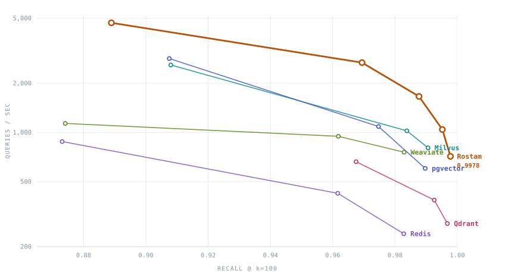
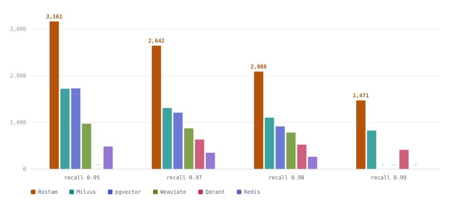
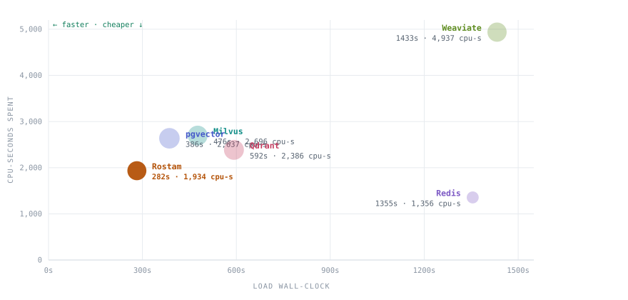

# Rostam client for VectorDBBench

A [VectorDBBench](https://github.com/zilliztech/VectorDBBench) (VDBBench) client
plugin for **Rostam**, so Rostam slots into the same neutral, third-party
benchmark matrix as Qdrant, Milvus, Weaviate, pgvector, Redis, Pinecone,
Elasticsearch, and ~30 other engines — on standardized datasets (SIFT, GIST,
Cohere, OpenAI) with VDBBench's standardized recall / QPS / p99 / cost metrics.

Keeping the plugin **here** (versioned in rostam-bench) rather than only in a
VDBBench fork means it tracks the engine; `install.sh` injects it into any
VDBBench checkout.

## What it does

Drives Rostam's HTTP/JSON vector API, mapping VDBBench's lifecycle onto it:

| VDBBench method | Rostam endpoint |
|---|---|
| `__init__` (create/drop) | `POST /v1/collections`, `DELETE /v1/collections/{c}` |
| `insert_embeddings` (`load_path="bulk"`, default) | `POST /v1/collections/{c}/points/bulk` (stage ids + vectors) |
| `insert_embeddings` (`load_path="payload"`) | `POST /v1/collections/{c}/points/bulk` (stage ids + vectors + payload) |
| `insert_embeddings` (`load_path="batch"`) | `POST /v1/collections/{c}/points/batch` (inline upsert) |
| `optimize` | `POST /v1/collections/{c}/points/bulk/build` (build HNSW); no-op on the `batch` path |
| `prepare_filter` / `search_embedding` | `POST /v1/collections/{c}/points/search` (with `filter` for `NumGE` cases) |

All three insert routes are driven over the binary ingest wire by default,
falling back to their JSON bodies against a server that does not speak it — see
[Binary ingest wire](#binary-ingest-wire).

The three load paths differ only in what the wire carries and who does the
indexing; all end in the same index:

- **`bulk`** (default) — stage ids and vectors, build concurrently in
  `optimize()`. The fast initial-load path. Carries no payload, so filter cases
  are **refused** rather than silently timed as unfiltered searches.
- **`payload`** — stage ids, vectors *and* a filterable scalar per point on the
  same route, built the same way. What filter cases should use.
- **`batch`** — upsert through `/points/batch`, indexed inline by a single
  writer. Also filter-capable, much slower, and kept as the control that
  `payload` is measured against.

Index knobs (`m`, `ef_construction`, `ef_search`, `metric`, optional `quant`)
come from `RostamHNSWConfig`. Connection and load-path knobs (`load_path`,
`binary_wire`) come from `RostamConfig`.

## Files

- `rostam/config.py` — `RostamConfig` (connection) + `RostamHNSWConfig` (HNSW params)
- `rostam/rostam.py` — the `Rostam(VectorDB)` client
- `install.sh` — clone VDBBench (if needed), copy the plugin in, register it in `clients/__init__.py`
- `smoke_test.py` — end-to-end adapter check on a SIFT subset (no full harness needed)
- `charts/make_charts.py` — regenerates the result charts below from the numbers
  in its `DATA` block, light and dark, as static SVG (`python3 charts/make_charts.py`)

## Quick start

```bash
# 1. install the plugin into a VDBBench checkout (clones one if absent)
./install.sh                          # creates ./VectorDBBench with rostam/ registered

# 2. deps + a running Rostam server (HTTP API)
pip install requests pydantic numpy
rostam-server -http 127.0.0.1:8080 -data ""

# 3. validate the adapter end-to-end (create -> insert -> build -> search, recall check)
VDB=./VectorDBBench SIFT=/tmp/rostam-sift1m/sift python smoke_test.py

# 4. full VDBBench run (after pip install -e ./VectorDBBench)
vectordbbench rostamhnsw --help
```

---

# Results

**27 cases, six engines, one continuous session.** VectorDBBench 1.0.22, cases
`Performance768D1M` (Cohere 1M, 768d, cosine) and `Performance768D1M1P`. HNSW
`m=16` / `ef_construction=200` / `k=100` pinned identically on every engine,
with `ef_search` swept. 12-core AMD EPYC Genoa, 22 GB RAM, one engine at a time
over loopback.

Rostam `edfe16c` · Qdrant v1.18.3 · Milvus v3.0.0 · PostgreSQL 17.10 +
pgvector 0.8.6 · Weaviate 1.31.0 · Redis 7.4.7 (redis-stack)

**Read [How to read these numbers](#how-to-read-these-numbers) first.** In
particular, the per-`ef` tables are curve data, **not** a cross-engine ranking —
the only like-for-like comparison is [at matched
recall](#the-comparison-that-counts-qps-at-matched-recall).

## The whole result in one plot

<picture>
  <source media="(prefers-color-scheme: dark)" srcset="charts/pareto-dark.svg">
  
</picture>

Each engine's measured operating points, joined; up and to the right is better,
throughput on a log axis. Rostam's curve sits **above every other engine at
every recall**, and extends furthest right — to 0.9978, the highest recall in
the matrix.

## The comparison that counts: QPS at matched recall

<picture>
  <source media="(prefers-color-scheme: dark)" srcset="charts/matched-recall-dark.svg">
  
</picture>

Each engine's QPS/recall curve interpolated to a common recall. Every cell is
interpolated **inside** that engine's measured range; blanks are outside it.

| Matched recall | **Rostam QPS** | vs Milvus | vs pgvector | vs Weaviate | vs Qdrant | vs Redis |
|---|--:|--:|--:|--:|--:|--:|
| 0.95 | **3,161** | 1.84× | 1.83× | 3.25× | — | 6.54× |
| 0.97 | **2,642** | 2.02× | 2.18× | 3.03× | 4.16× | 7.53× |
| 0.98 | **2,088** | 1.90× | 2.28× | 2.67× | 3.98× | 7.90× |
| 0.99 | **1,471** | 1.78× | — | — | 3.55× | — |

The lead is **stable across the whole range** — 1.8–2.3× against the strongest
competitors, ~3× Weaviate, ~4× Qdrant, 6.5–7.9× Redis. It does not depend on
choosing a favourable operating point.

### Highest recall each engine actually reached

| Engine | Best recall | QPS there |
|---|--:|--:|
| **Rostam** | **0.9978** | **714** |
| Qdrant | 0.9968 | 277 |
| Milvus | 0.9906 | 805 |
| pgvector | 0.9897 | 603 |
| Weaviate | 0.9829 | 757 |
| Redis | 0.9828 | 240 |

Rostam reaches the highest recall in the matrix *and* serves 2.6× the throughput
Qdrant manages at its own best point. Its recall does not saturate — the curve
was still climbing at ef=2000.

## Ingest: wall-clock against CPU spent

<picture>
  <source media="(prefers-color-scheme: dark)" srcset="charts/load-cpu-dark.svg">
  
</picture>

Bottom-left is best — fast *and* cheap, and Rostam is alone in that corner. It
runs **more cores at once** than Qdrant or Milvus during the build, yet spends
the **least total CPU**, because it finishes in half the time. Marker area
encodes cores in use. Redis is the control case at the far right: exactly 1.00
core, and 4.8× the wall-clock.

## Per-ef curves

`Load CPU` is engine-only CPU consumed during the load phase (cores avg in
parentheses); `Cores @ max` is engine-only CPU during the concurrency level that
produced max QPS. Both from cgroup v2 counters — see
[How to read these numbers](#how-to-read-these-numbers).

### ef_search = 100

| Engine | Load s | insert/build | Load CPU (cores) | Max QPS | Cores @ max | QPS/core | Recall |
|---|--:|--:|--:|--:|--:|--:|--:|
| **Rostam** | **297.2** | 121.7/175.4 | **2,034 (6.84)** | **4,691.5** | 6.12 | 766.8 | 0.8889 |
| pgvector | 381.5 | 137.7/243.8 | 2,627 (6.89) | 2,833.2 | 10.39 | 272.7 | 0.9075 |
| Milvus | 666.1 | 101.9/564.2 | 3,782 (5.68) | 2,588.9 | 7.73 | 334.8 | 0.9080 |
| Weaviate | 1,397.7 | 1397.7/0.0 | 4,840 (3.46) | 1,135.5 | 8.17 | 139.0 | 0.8741 |
| Redis | 1,387.0 | 1387.0/0.0 | 1,388 (1.00) | 879.9 | 0.99 | **893.3** | 0.8731 |
| Qdrant | 608.2 | 312.9/295.3 | 2,422 (3.98) | 662.0 | 7.21 | 91.8 | 0.9675 |

### ef_search = 300

| Engine | Load s | insert/build | Load CPU (cores) | Max QPS | Cores @ max | QPS/core | Recall |
|---|--:|--:|--:|--:|--:|--:|--:|
| **Rostam** | **282.2** | 115.9/166.3 | **1,934 (6.85)** | **2,675.4** | 7.54 | 354.8 | 0.9694 |
| pgvector | 386.1 | 143.6/242.6 | 2,637 (6.83) | 1,087.1 | 11.04 | 98.5 | 0.9747 |
| Milvus | 476.3 | 96.5/379.8 | 2,696 (5.66) | 1,023.2 | 9.81 | 104.3 | 0.9838 |
| Weaviate | 1,432.7 | 1432.7/0.0 | 4,937 (3.45) | 947.2 | 8.86 | 106.9 | 0.9618 |
| Redis | 1,354.9 | 1354.9/0.0 | 1,356 (1.00) | 423.9 | 1.00 | 424.5 | 0.9616 |
| Qdrant | 592.2 | 306.9/285.3 | 2,386 (4.03) | 385.6 | 9.92 | 38.9 | 0.9926 |

### ef_search = 600

| Engine | Load s | insert/build | Load CPU (cores) | Max QPS | Cores @ max | QPS/core | Recall |
|---|--:|--:|--:|--:|--:|--:|--:|
| **Rostam** | **288.7** | 117.8/170.9 | **1,988 (6.88)** | **1,660.9** | 8.90 | 186.7 | 0.9877 |
| Milvus | 574.6 | 101.3/473.3 | 3,231 (5.62) | 805.4 | 10.10 | 79.8 | 0.9906 |
| Weaviate | 1,386.0 | 1386.0/0.0 | 4,831 (3.49) | 756.9 | 9.53 | 79.5 | 0.9829 |
| pgvector | 371.2 | 133.7/237.5 | 2,569 (6.92) | 602.9 | 11.37 | 53.0 | 0.9897 |
| Qdrant | 604.6 | 294.2/310.3 | 2,535 (4.19) | 276.9 | 10.50 | 26.4 | 0.9968 |
| Redis | 1,374.0 | 1374.0/0.0 | 1,375 (1.00) | 239.8 | 1.00 | 240.3 | 0.9828 |

### Rostam, high-recall regime

| ef | Load s | Max QPS | Cores @ max | Recall |
|--:|--:|--:|--:|--:|
| 1200 | 284.5 | 1,042.3 | 9.81 | 0.9952 |
| 2000 | 286.2 | 713.9 | 10.11 | 0.9978 |

Load is flat at ~285 s across every ef point — `ef_search` is a query-time
parameter, so the ~285 s load holds for **every** operating point on the curve.

## Filter case

`Performance768D1M1P` applies `id >= 10000` to a 1M-row dataset, so **99% of
rows pass**. (VDBBench labels this "Filter 1%" after the *excluded* fraction,
which reads backwards.)

| Engine | Load s | Load CPU (cores) | Max QPS | Cores @ max | QPS/core | Recall |
|---|--:|--:|--:|--:|--:|--:|
| **Rostam** | **290.0** | 2,002 (6.90) | **2,543.2** | 7.93 | 320.5 | 0.9695 |
| pgvector | 377.9 | 2,685 (7.11) | 1,086.0 | 11.17 | 97.2 | 0.9744 |
| Milvus | 475.6 | 2,703 (5.68) | 1,029.3 | 10.13 | 101.6 | 0.9827 |

**Qdrant, Weaviate and Redis are structurally absent, not omitted** — their
VDBBench adapters declare `NonFilter` support only.

**Filtering is effectively free** on this predicate. Rostam unfiltered vs
filtered, same session: 2,675.4 → 2,543.2 QPS (**1.05×**), recall 0.9694 →
0.9695, load 282.2 → 290.0 s. That 5.2% cost is **below the measured noise
floor** (see below). pgvector shows the same: 1,087.1 → 1,086.0.

## Same-session controls

Each is a pair of runs minutes apart differing in exactly one variable.

### 1. The binary ingest wire moves ingest and nothing else

| Rostam ef=300 | JSON | Binary | Change |
|---|--:|--:|--:|
| Insert | 636.2 s | 115.9 s | **5.49× faster** |
| Build | 170.8 s | 166.3 s | unchanged |
| **Total load** | **807.0 s** | **282.2 s** | **2.86× faster** |
| Load CPU | 2,413 s (2.99 cores) | 1,934 s (6.85 cores) | **−20% CPU** |
| Recall | 0.9691 | 0.9694 | unchanged |
| Max QPS | 2,517.1 | 2,675.4 | 6.3% (noise) |

The wire cuts wall-clock 2.86×, cuts **total ingest CPU by 20%**, and raises
build parallelism from 2.99 to 6.85 cores — JSON decoding was both burning CPU
and serializing the ingest path.

**This pair also establishes the noise floor.** The wire cannot affect query
throughput, so the 6.3% QPS gap between these two runs is pure measurement
noise: **treat any QPS difference below ~6% as a tie.**

### 2. Payload-carrying bulk staging vs inline upsert

| Filter case, ef=300 | Inline (`batch`) | Payload-bulk | Change |
|---|--:|--:|--:|
| **Load** | **1,756.2 s** | **290.0 s** | **6.06× faster** |
| Load CPU | 1,908 s (1.09 cores) | 2,002 s (6.90 cores) | same CPU, 6× the parallelism |
| Max QPS | 2,477.0 | 2,543.2 | 2.7% (noise) |
| Recall | 0.9695 | 0.9695 | **identical** |

Recall matches to four decimals and QPS differs by less than half the noise
floor, so the two paths build an equivalent index — the 6× is purely in how the
payload reaches the server.

### 3. CPU contention (inconclusive, reported anyway)

Rostam ef=100 with the engine pinned to cores 0–7 and the VDBBench client to
8–11:

| | Max QPS | Cores @ max | Recall |
|---|--:|--:|--:|
| unpinned | 4,691.5 | 6.12 | 0.8889 |
| pinned | 3,670.6 | **5.12 of 8 available** | 0.8894 |

The engine had 8 cores and used 5.12 — it was **not** core-limited — yet
throughput fell 21.8%. The constraint moved to the client, throttled to 4 cores.
This **confirms the client is a binding constraint and that the QPS figures here
are floors**, but it cannot measure the ceiling: on a 12-core box no split gives
both engine and client enough headroom. Settling it needs the client on a
separate machine.

---

## How to read these numbers

Three things make a naive reading of any vector-database benchmark wrong, and
all three bite here.

### `ef` is not the same amount of work in different engines

`ef` is the size of the candidate list HNSW keeps while searching: bigger `ef`
explores more of the graph, so recall rises and throughput falls. Every engine
here is pinned to the same `m=16` / `ef_construction=200` / swept `ef_search`.

But **Qdrant splits the collection into 5 segments** (measured:
`segments_count: 5`, `points_count: 1000000`, `indexed_vectors_count: 1000000`,
`default_segment_number: 0` — its own auto choice, not something the harness
imposed). Each segment carries its own HNSW graph, and a query runs `hnsw_ef`
against *every* segment and merges. At a nominal ef=100 Qdrant does ~5 graph
searches where a single-index engine does one. That is why its recall at low ef
looks so strong (0.9675 where others land 0.87–0.91) and why its throughput is
an order of magnitude lower.

Milvus is **not** segmented here — its VDBBench adapter force-merges to a single
segment (`MILVUS_FORCE_MERGE_TARGET_SIZE_MB = ((1<<63)-1)//1024²`).

Even between two single-index engines ef is not comparable: Rostam at ef=600
(0.9877 recall, 1,660.9 QPS) beats Milvus at ef=300 (0.9838, 1,023.2) on **both**
axes at once. Rostam's ef is simply cheaper per unit — it needs a larger number
to reach a given recall and still gets there faster.

**So: compare at matched recall, never at matched ef.**

### Throughput without CPU is not a result

An engine that is "faster" because it was handed more cores has demonstrated
nothing. Every run samples cgroup v2 `usage_usec` for the engine every 2 s — a
monotonic counter, so CPU consumed in any window is an exact subtraction rather
than an integrated estimate — and reports the cores actually in use at the
concurrency that produced max QPS.

### QPS-per-core rewards an engine for refusing to scale

It is the honest efficiency measure, but it must be read next to raw QPS.
**Redis posts the best QPS/core in the matrix (893.3) by using 0.99 cores** and
leaving eleven idle: its throughput is flat at ~880 QPS from concurrency 10 to
80. That is an inability to scale, not efficiency. Rostam is the only engine
strong on both axes — high per-core efficiency *and* it actually scales.

## Methodology and caveats

**Every number is same-session.** Cross-session comparisons on this box are
worthless: with engine code **unchanged** between sessions, Milvus's own max QPS
has moved by **42%**. All 27 cases come from one continuous session, engines
interleaved by ef point rather than grouped, with the order rotated between
rounds so no engine sits systematically at one end of the drift. Any comparison
built by reading numbers out of two different sessions is not supported by the
data.

**The client shares the box with the engine.** VDBBench drives load over
loopback from the same 12-core machine, and during high-concurrency phases the
system runs oversubscribed (load average 18–24 on 12 cores). This is
*asymmetric*, and not in Rostam's favour: a slow engine barely troubles the
client, while the fastest engine forces it to work hardest and then competes
with it for the same cores. The QPS figures for the fast engines are floors. See
[control 3](#3-cpu-contention-inconclusive-reported-anyway).

**pgvector is deliberately given build resources** — `maintenance_work_mem=6GB`,
11 parallel maintenance workers, and `--shm-size=10g` on its container. Its
defaults build HNSW single-threaded in a 64 MB buffer, and the Docker default
64 MB `/dev/shm` makes a parallel build fail outright with `DiskFull`. Every
other engine here uses all cores by default; this is what parity means, not a
favour. It shows: pgvector is the second-fastest loader in the matrix and beats
Milvus on raw QPS at ef=100.

**The stock Weaviate adapter needed a correctness fix to run at all.**
VDBBench's Weaviate client wraps each insert in `with self.client.batch`, whose
`__exit__` shuts down a BatchExecutor **shared by the whole client**. VDBBench
loads with several concurrent workers against one client, so the first worker to
finish tore the executor down underneath the others and the case died with
`cannot schedule new futures after shutdown`. The patch uses the batch directly
and flushes explicitly, leaving the executor alive; batching, batch size and
dynamic mode are unchanged. A harness defect, not a Weaviate limitation and not
a tuning change.

**Absences are structural.** On the filter case only Rostam, Milvus and pgvector
appear — the others declare `NonFilter` support only. Qdrant runs through
`QdrantLocal` rather than `QdrantCloud` because QdrantCloud exposes no
`ef_construct`, which would break the build-parameter parity the whole table
rests on; the cost is that Qdrant is measured over REST, the same shape as
Rostam's own HTTP surface.

**The box has other tenants.** It runs unrelated ClickHouse and Aerospike
containers continuously, which is part of why it drifts; every timed phase is
gated on load average.

## Known limitations (v1 scaffold)

- **Collection-level `ef_search`.** Rostam's search request has no per-query ef
  field, so ef is set at collection creation. Sweeping ef means re-running the
  case with `drop_old=True` — which is why Rostam appears once per ef point with
  a full load each time, while every other engine here takes ef per query. A
  per-query ef would need a small engine-side addition; tracked as a future
  enhancement.
- **`ef_search` is clamped to `k`** (`vector/hnsw.go`: `if ef < k { ef = k }`),
  so at k=100 an ef below 100 has no effect.
- **Int-filter cases are wired; label-filter cases are not.** `NumGE` cases map
  onto Rostam's filter tree and require `load_path="payload"` (or `"batch"`).
  `StrEqual` / label-filter cases and `tenant` are accepted-and-ignored.

## Binary ingest wire

All insert routes ship vectors as raw big-endian f32 over
`Content-Type: application/octet-stream` ("RVB1") instead of as JSON text. JSON
encode/decode — not the index build — dominated load time on a 768d corpus.

```
magic  b"RVB1"
flags  u32   bit0 payloads present, bit1 upsert
count  u32
dim    u32
rows   count x [ id u64 ][ dim x f32 ]
pays   count x [ len u32 ][ len bytes of JSON ]   (only when bit0)
```

All big-endian, matching Rostam's internal op wire, so the server reads the row
region straight into the staging op with no per-float conversion.

The plugin probes the binary wire on its first insert and falls back permanently
to JSON when the server answers 400/404/415 (a pre-binary server applies nothing
in that case, so the chunk is simply re-sent). Once one binary request has
succeeded the fallback is disabled — a later rejection is a real error and must
surface rather than silently degrading the rest of the load. Set
`binary_wire=False` to force JSON.

## Fairness note

A benchmark adapter is only as honest as its tuning. This client uses matched
HNSW params and the bulk-stage→build path, so Rostam is represented at its real
performance — and the same care is applied to the comparators, which is why
pgvector gets real build resources and why the Weaviate adapter was fixed rather
than dropped.

Where the data cuts against Rostam it is reported as measured: its recall at a
matched `ef` is **lower** than Milvus's, pgvector's and Qdrant's, and its QPS is
measured under client contention that penalises the fastest engine most. The
matched-recall table exists precisely because the per-ef rows flatter some
engines and not others.
